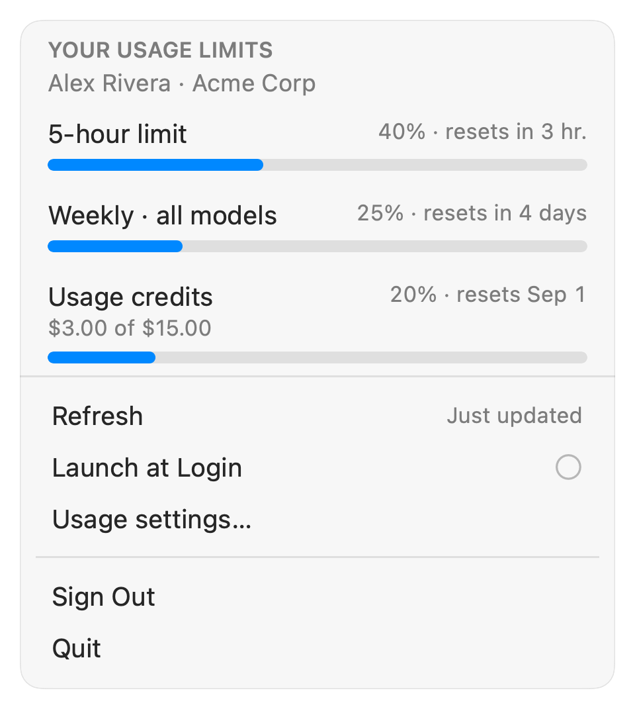

# LimitPeek

Your Claude usage limits in the macOS menu bar.

[](https://github.com/nvmddev/limitpeek/actions/workflows/ci.yml)
[](https://github.com/nvmddev/limitpeek/releases/latest)
[](#requirements)
[](LICENSE)

The 5-hour window sits in the menu bar as a bar and a percentage. Everything
else — weekly limits, usage credits — is one click away.

<picture>
  <source media="(prefers-color-scheme: dark)" srcset="docs/menubar-dark.png">
  
</picture>

<sub>Actual size, at 40%, 84% and 97%.</sub>

> Unofficial, and not affiliated with Anthropic. It reads the same undocumented
> endpoint the official clients use, which means it can break when that changes.

## Install

```sh
brew install --cask nvmddev/tap/limitpeek
```

Or grab the `.dmg` from the [latest release](https://github.com/nvmddev/limitpeek/releases/latest)
and drag **LimitPeek.app** into `/Applications`.

Sign in once from the menu bar item: it opens claude.com in your browser and you
paste the code back.

## What it shows

- The 5-hour limit, in the menu bar. Orange at 80%, red at 95%.
- Weekly limits and usage credits in the popover, including per-model weekly
  buckets when your plan has them.
- Launch at login, if you want it.

<picture>
  <source media="(prefers-color-scheme: dark)" srcset="docs/popover-dark.png">
  
</picture>

<sub>Sample account; the numbers are the response the tests pin.</sub>

It polls every three minutes, stops while the machine is asleep, and stretches to
five minutes in Low Power Mode. If the server rate-limits it, it backs off and
eases back to the normal cadence once requests land again.

## Requirements

macOS 14 (Sonoma) or newer. Universal binary, so Apple silicon and Intel both
run natively.

## Privacy

The token is requested with the `user:profile` scope only — it can read your
profile and usage, and cannot spend inference. It lives in the Keychain and
nowhere else: not in a file, not in a log, not in UserDefaults.

The app is sandboxed with two entitlements, `app-sandbox` and `network.client`.
Sign-in uses the paste-the-code redirect rather than a local listener, so it
never needs to accept an inbound connection. It talks to `api.anthropic.com` and
`platform.claude.com` and nothing else. No telemetry.

Signing in here does not disturb your `claude` CLI login — LimitPeek holds its
own token.

## Build

```sh
./build.sh          # release, universal → build/LimitPeek.app
./build.sh --debug  # host arch only, faster
./build.sh --run    # build and relaunch
swift test
```

Needs Xcode for universal builds and swift-testing; `build.sh` finds it even if
`xcode-select` still points at the Command Line Tools. Zero dependencies.

The pictures above are drawn by the app's own views —
`scripts/make-readme-art.sh` re-renders them into `docs/` after a change to the
menu bar label, the popover or the icon.

Signing, notarisation and the Keychain permission prompt are covered in
[docs/signing.md](docs/signing.md).

## Where the data comes from

`GET https://api.anthropic.com/api/oauth/usage`, with an OAuth bearer token,
plus `/api/oauth/profile` once at sign-in for the name in the header. `Tests/`
pins the parts of the response the app relies on, so a change to the API shows
up as a failing test rather than an empty popover.

## License

MIT
